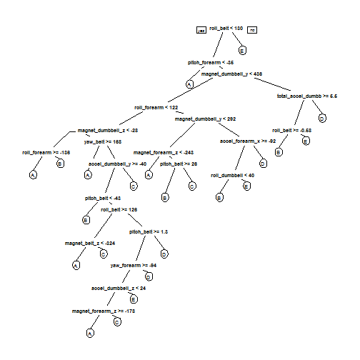

### Overview

Using devices such as Jawbone Up, Nike FuelBand, and Fitbit it is now possible to collect a large amount of data about personal activity relatively inexpensively. These type of devices are part of the quantified self movement - a group of enthusiasts who take measurements about themselves regularly to improve their health, to find patterns in their behavior, or because they are tech geeks. One thing that people regularly do is quantify how much of a particular activity they do, but they rarely quantify how well they do it. In this project, your goal will be to use data from accelerometers on the belt, forearm, arm, and dumbell of 6 participants. They were asked to perform barbell lifts correctly and incorrectly in 5 different ways. More information is available from the website here: http://groupware.les.inf.puc-rio.br/har (see the section on the Weight Lifting Exercise Dataset).
### Data

The training data for this project are available here: https://d396qusza40orc.cloudfront.net/predmachlearn/pml-training.csv

The test data are available here: https://d396qusza40orc.cloudfront.net/predmachlearn/pml-testing.csv

The data for this project come from this source: http://groupware.les.inf.puc-rio.br/har. If you use the document you create for this class for any purpose please cite them as they have been very generous in allowing their data to be used for this kind of assignment.
### Goal

The goal of your project is to predict the manner in which they did the exercise. This is the "classe" variable in the training set. You may use any of the other variables to predict with. You should create a report describing how you built your model, how you used cross validation, what you think the expected out of sample error is, and why you made the choices you did. You will also use your prediction model to predict 20 different test cases.


```r
library(caret)
```

```
## Loading required package: lattice
## Loading required package: ggplot2
```

```r
library(rpart)
library(rpart.plot)
library(RColorBrewer)
library(rattle)
```

```
## Loading required package: RGtk2
## Rattle: A free graphical interface for data mining with R.
## Version 3.5.0 Copyright (c) 2006-2015 Togaware Pty Ltd.
## Type 'rattle()' to shake, rattle, and roll your data.
```

```r
library(randomForest)
```

```
## randomForest 4.6-10
## Type rfNews() to see new features/changes/bug fixes.
```
### Getting the data

Data can be download from below URL and store in data folder


```r
trainUrl <-"https://d396qusza40orc.cloudfront.net/predmachlearn/pml-training.csv"
testUrl <- "https://d396qusza40orc.cloudfront.net/predmachlearn/pml-testing.csv"
trainFile <- "./data/pml-training.csv"
testFile  <- "./data/pml-testing.csv"
if (!file.exists("./data")) {
  dir.create("./data")
}
if (!file.exists(trainFile)) {
  download.file(trainUrl, destfile=trainFile, method="curl")
}
if (!file.exists(testFile)) {
  download.file(testUrl, destfile=testFile, method="curl")
}
```
Let load the data into two two data frames

```r
training <- read.csv("./data/pml-training.csv", na.strings=c("NA","#DIV/0!",""))
testing <- read.csv("./data/pml-testing.csv", na.strings=c("NA","#DIV/0!",""))
dim(training)
```

```
## [1] 19622   160
```

```r
dim(testing)
```

```
## [1]  20 160
```
### Clean the data
Let clean the data and get rid of observations do not contribute much to the accelerometer measurements.

```r
training <- training[, colSums(is.na(training)) == 0] 
testing <- testing[, colSums(is.na(testing)) == 0] 

classe <- training$classe
trainRemove <- grepl("^X|timestamp|window", names(training))
training <- training[, !trainRemove]
trainCleaned <- training[, sapply(training, is.numeric)]
trainCleaned$classe <- classe

testRemove <- grepl("^X|timestamp|window", names(testing))
testing <- testing[, !testRemove]
testCleaned <- testing[, sapply(testing, is.numeric)]
```
Now, the cleaned training data set contains 19622 observations and 53 variables, while the testing data set contains 20 observations and 53 variables. 

### Partioning the training set into two
Partioning Training data set into two data sets, 60% for myTraining, 40% for myTesting:

```r
set.seed(1234)

inTrain <- createDataPartition(y=trainCleaned$classe, p=0.6, list=FALSE)

myTraining <- trainCleaned[inTrain, ] 
myTesting <- trainCleaned[-inTrain, ]
dim(myTraining)
```

```
## [1] 11776    53
```

```r
dim(myTesting)
```

```
## [1] 7846   53
```

### Using ML algorithms for prediction: Decision Tree Visualization


```r
model1 <- rpart(classe ~ ., data=myTraining, method="class")

prp(model1)
```

 
Predicting

```r
predictions1 <- predict(model1, myTesting, type = "class")
```
### Using confusion Matrix to test results:


```r
confusionMatrix(predictions1, myTesting$classe)
```

```
## Confusion Matrix and Statistics
## 
##           Reference
## Prediction    A    B    C    D    E
##          A 1980  212   21   72   31
##          B   85  862   72   90   98
##          C   56  153 1086  209  175
##          D   71  101  110  823   89
##          E   40  190   79   92 1049
## 
## Overall Statistics
##                                           
##                Accuracy : 0.7392          
##                  95% CI : (0.7294, 0.7489)
##     No Information Rate : 0.2845          
##     P-Value [Acc > NIR] : < 2.2e-16       
##                                           
##                   Kappa : 0.6699          
##  Mcnemar's Test P-Value : < 2.2e-16       
## 
## Statistics by Class:
## 
##                      Class: A Class: B Class: C Class: D Class: E
## Sensitivity            0.8871   0.5679   0.7939   0.6400   0.7275
## Specificity            0.9401   0.9455   0.9085   0.9434   0.9374
## Pos Pred Value         0.8549   0.7142   0.6468   0.6893   0.7234
## Neg Pred Value         0.9544   0.9012   0.9543   0.9304   0.9386
## Prevalence             0.2845   0.1935   0.1744   0.1639   0.1838
## Detection Rate         0.2524   0.1099   0.1384   0.1049   0.1337
## Detection Prevalence   0.2952   0.1538   0.2140   0.1522   0.1848
## Balanced Accuracy      0.9136   0.7567   0.8512   0.7917   0.8324
```

### Using ML algorithms for prediction: Random Forests


```r
model2 <- randomForest(classe ~. , data=myTraining)
predictions2 <- predict(model2, myTesting, type = "class")
```

### Using confusion Matrix to test results:

```r
confusionMatrix(predictions2, myTesting$classe)
```

```
## Confusion Matrix and Statistics
## 
##           Reference
## Prediction    A    B    C    D    E
##          A 2231   12    0    0    0
##          B    0 1501    9    0    0
##          C    0    5 1354   22    2
##          D    1    0    5 1262    2
##          E    0    0    0    2 1438
## 
## Overall Statistics
##                                           
##                Accuracy : 0.9924          
##                  95% CI : (0.9902, 0.9942)
##     No Information Rate : 0.2845          
##     P-Value [Acc > NIR] : < 2.2e-16       
##                                           
##                   Kappa : 0.9903          
##  Mcnemar's Test P-Value : NA              
## 
## Statistics by Class:
## 
##                      Class: A Class: B Class: C Class: D Class: E
## Sensitivity            0.9996   0.9888   0.9898   0.9813   0.9972
## Specificity            0.9979   0.9986   0.9955   0.9988   0.9997
## Pos Pred Value         0.9947   0.9940   0.9790   0.9937   0.9986
## Neg Pred Value         0.9998   0.9973   0.9978   0.9964   0.9994
## Prevalence             0.2845   0.1935   0.1744   0.1639   0.1838
## Detection Rate         0.2843   0.1913   0.1726   0.1608   0.1833
## Detection Prevalence   0.2859   0.1925   0.1763   0.1619   0.1835
## Balanced Accuracy      0.9987   0.9937   0.9926   0.9901   0.9985
```
Therefore, as per the accuracy from the above, random Forests yielded better Results.


### Function to generate files for submission


```r
answer <- predict(model2, testing, type = "class")

pml_write_files = function(x){
  n = length(x)
  for(i in 1:n){
    filename = paste0("problem_id_",i,".txt")
    write.table(x[i],file=filename,quote=FALSE,row.names=FALSE,col.names=FALSE)
  }
}

pml_write_files(answer)
```
